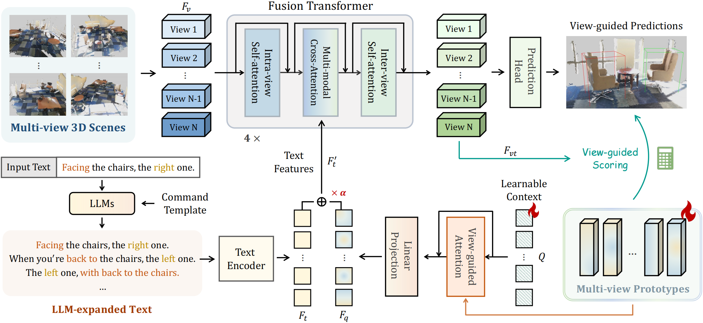

# ViewRefer: Grasp the Multi-view Knowledge for 3D Visual Grounding with GPT and Prototype Guidance

Official implementation of ['ViewRefer: Grasp the Multi-view Knowledge for 3D Visual Grounding with GPT and Prototype Guidance'](https://arxiv.org/pdf/2303.16894.pdf).

## ViewRefer
We propose ViewRefer, a multi-view framework for 3D visual grounding, which grasps view knowledge to alleviate the challenging view discrepancy issue. For the text and 3D modalities, we respectively introduce LLM-expanded grounding texts and a fusion transformer for capturing multi-view information. We present multi-view prototypes to provide highlevel guidance to our framework, which contributes to superior 3D grounding performance.

  

Code will be available in a few days.
